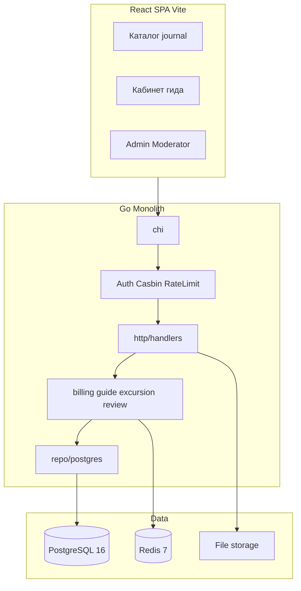

# Experts Tourister — спецификация и статус

> Живой документ: продуктовая спека + факт реализации + остаточные риски + оценка.  
> Статус репозитория: **MVP ready for soft launch (growth mode)** / pre-paid-production.  
> Обновлено: **2026-08-10** (после закрытия пробелов MVP).  
> Исходная спека: 2026-08-08.

Связанные документы:

| Документ | Назначение |
|----------|------------|
| [README.md](README.md) | quick start, demo accounts, prod checklist |
| [docs/ENV.md](docs/ENV.md) | переменные окружения, rate limits, seed, monetization |
| [DEPLOY.md](DEPLOY.md) | деплой |
| `backend/openapi/openapi.yaml` | HTTP контракт |

> `docs/ARCHITECTURE.md`, `docs/CONVENTIONS.md`, `docs/adr/*` — могут отсутствовать на диске; решения зафиксированы в §§15–16, §30.

---

## 0. Changelog

| Изменение | Решение |
|-----------|---------|
| Статус | Soft-launch MVP закрыт кодом; осталось: реальный эквайринг, OpenAPI sync, optional E2E |
| Бренд UI | **Gaido** (`000026`) при продуктовом имени Experts Tourister |
| Отзывы | `UNIQUE(author_id, excursion_id)` |
| Featured / Journal | В продукте сверх исходного MVP |
| Excursion details | `body_html`, included/excluded items |
| **Монетизация** | Один мастер-флаг `guide_placement_payments_enabled` (default **false** = growth). Отдельный `contacts_require_subscription` **удалён** |
| Contact paywall | Привязан к тому же флагу: off → контакты ACTIVE открыты; on → нужна ACTIVE sub |
| Soft delete | `users.deleted_at` + каскад `guide_profiles → BLOCKED` |
| Expiration | Background job `ExpireStale` (ticker 5m в `app.New`) |
| RBAC | Tourist policy сужена; guide `CreateGeoCity` убран (гео — moderator) |
| Billing | UNIQUE `payment_id`, idempotent activate, MarkPaid внутри tx |
| Public guide | Только `ACTIVE` (иначе 404) |
| Notifications | API list/longpoll/mark-read + UI |
| Calendar | API + UI CRUD |
| Moderator / Admin UI | Full moderator; admin audit + bypass + monetization toggle |
| SEO | OG/canonical, `/robots.txt`, `/sitemap.xml`, JSON-LD Person/TouristTrip |
| Seed | Не на старте API; `cmd/seed -demo` / `LOCAL_SEED=1` |
| CI | migrate + go test/vet + frontend lint/test/build |
| Migrations | `000001`…`000033` (hardening) |

---

## 1. Что это за продукт

**Experts Tourister (Gaido)** — React SPA + Go API — **каталог гидов и экскурсий**.

Референс UX: [Tripster Experience](https://experience.tripster.ru/) (паттерны, не бренд/assets).

### Главный flow

```
Гид регистрируется
  → профиль + тип (GUIDE / ENTERTAINER / COMPANION)
  → опционально лицензия (только бейдж в каталоге)
  → города размещения (из каталога; новые города — модератор)
  → ACTIVE: stub payment / admin bypass / growth без оплаты
  → публикует экскурсии (модерация)
  → турист видит контакты по правилам §7
  → связь вне платформы → отзыв на экскурсию
```

### Monetization

| Режим | `guide_placement_payments_enabled` | Контакты ACTIVE | Checkout / featured |
|-------|-------------------------------------|-----------------|---------------------|
| Growth (сейчас) | `false` | Видны без sub | Не обязателен; admin bypass OK |
| Paid | `true` | Только ACTIVE sub + `expires_at > NOW()` | GUIDE_PLACEMENT + featured обязательны |

Тумблер в админке. Backend не отдаёт скрытые контакты в JSON.

---

## 2. Что есть / чего нет

### В продукте

| Область | Готовность |
|---------|------------|
| Auth JWT + refresh + Argon2id | ✅ |
| Casbin RBAC (tourist сужен) + ownership | ✅ |
| Geo, карта, поиск | ✅ |
| Гиды, лицензии, public DTO, paywall | ✅ |
| Экскурсии CRUD + модерация + каталог | ✅ |
| Stub billing + idempotent confirm + bypass | ✅ |
| Featured placements | ✅ |
| Отзывы per excursion, rating, favorites | ✅ |
| Notifications + longpoll + mark-read + UI | ✅ |
| Медиа watermark images | ✅ (PDF watermark no-op) |
| Calendar CRUD API + UI | ✅ |
| Admin: users, guides, analytics, settings, audit, bypass, journal, soft-delete | ✅ |
| Moderator: excursions approve/reject, reviews, docs, geo, journal | ✅ |
| Journal CMS | ✅ |
| Soft-delete → BLOCKED guide | ✅ |
| Expiration job | ✅ |
| SEO OG/canonical/sitemap/robots/JSON-LD | ✅ |
| CI | ✅ |
| Deploy admin-gated | ✅ опционально |

### Явно НЕТ в MVP

Бронирование туристом · оплата экскурсий / payout · чат · WebSocket · Elasticsearch · микросервисы · event sourcing · fake payment при bypass · **реальный payment provider** (следующий этап).

---

## 3. Роли

| Роль | Код | Scope |
|------|-----|--------|
| Турист | `ROLE_TOURIST` | favorites, reviews, notifications (+ auth `/account/me\|profile`) |
| Гид | `ROLE_GUIDE` | `/account/guide/*`, media upload |
| Модератор | `ROLE_MODERATOR` | excursions, reviews, documents, geo, journal |
| Админ | `ROLE_ADMIN` | + users, settings, analytics, audit, bypass, deploy |

`g, ROLE_ADMIN, ROLE_MODERATOR`. Ownership — service layer.

**RBAC (факт):** tourist **не** имеет `/api/v1/account/*`. Guide geo create убран; города создаёт moderator.

---

## 4. Типы гидов и документы

Лицензия опциональна — только бейдж GUIDE/ENTERTAINER. COMPANION — всегда.  
Фильтр каталога по сохранённому `guide_type`.

---

## 5. Жизненный цикл гида

```
DRAFT → WAITING_PAYMENT → ACTIVE
ACTIVE ↔ SUSPENDED
ACTIVE → BLOCKED
ACTIVE → EXPIRED   # ExpireStale при payments=on и нет ACTIVE sub
EXPIRED → ACTIVE   # renew / bypass
```

Инварианты:

1. Лицензия не блокирует ACTIVE.  
2. ACTIVE без sub допустим при growth / admin bypass.  
3. Платность через `guide_subscriptions`.  
4. Контакты — §7 (`guide_placement_payments_enabled`).  
5. Soft-delete user → guide `BLOCKED`.  
6. Публичный `GET /guides/{slug}` — только ACTIVE.

---

## 6. Подписка и платежи

**Purpose:** `GUIDE_PLACEMENT` (+ featured guide/excursion).

Stub:

1. `POST …/billing/checkout`  
2. Payment `PENDING`  
3. Confirm: guide `…/billing/confirm/{id}` или admin `/payments/{id}/confirm`  
4. `ActivateGuideSubscription` — transactional, idempotent по `payment_id`

`PAYMENT_STUB_ENABLED=false` в production.

Admin bypass при `guide_placement_payments_enabled=false` → `ADMIN_BYPASS` + audit, без fake payment.

**Идемпотентность (факт):** partial UNIQUE index на `payment_id` (`000033`); early-return если payment уже активировал; MarkPaid внутри tx активации (и для featured).

---

## 7. Contact paywall

```go
// requireSub == guide_placement_payments_enabled (default false)
contactsVisible =
  guide.status == ACTIVE
  AND ( !requireSub OR (sub.ACTIVE AND sub.expires_at > NOW()) )
```

| payments | ACTIVE без sub | ACTIVE с sub |
|----------|----------------|--------------|
| off | контакты видны | видны |
| on | скрыты | видны |

Security: не в list endpoints; не в Redis cache; DTO `BuildPublicGuideDTO`.

---

## 8. Экскурсии

`body_html` (sanitize), included/excluded. Типы `INDIVIDUAL` / `GROUP`.  
`max_guests` ≥ 1, API cap ~100, без 6/20.  
Публично: `PUBLISHED` + guide `ACTIVE`.

---

## 9. Отзывы

`UNIQUE(author_id, excursion_id)`. Rating transactional. Reply через `review_comments`.

---

## 10. Гео / поиск / ротация

`countries → regions → cities`. ILIKE + фильтры.  
Ротация: `last_shown_at ASC, rating_avg DESC`. Featured — paid boost.  
Гид выбирает существующий city; создание geo — `/moderator/geo/*`.

---

## 11. Календарь

Информационные слоты CRUD (API + UI). Без бронирований.

---

## 12. Уведомления

PG source of truth; Redis signal.  
`GET /notifications`, `GET /notifications/longpoll`, `PATCH /notifications/{id}/read`.  
UI: кабинет + badge unread + longpoll reconnect.

Типы: excursion approved/rejected, subscription activated/expired, new review, review comment.

---

## 13. Медиа

Private original + public watermarked (images). PDF watermark no-op. MIME magic-bytes.

---

## 14. Audit

Модерация, bypass, settings, block/unblock и т.д. API + вкладка «Аудит» в админке.

---

## 15. Архитектура



Stack: Go/chi, PG16, Redis7, Casbin, JWT+opaque refresh, Argon2id, React/TS/Vite/Tailwind, TanStack Query, Vitest + go test, GitHub Actions.

---

## 16. API группы

`/api/v1`: auth, geo, guides, excursions, articles, reviews, favorites, account, account/guide, moderator, admin, notifications, media.  
SEO: `/robots.txt`, `/sitemap.xml` (нужен `PUBLIC_BASE_URL`).  
Health: `/healthz`, `/readyz`.

---

## 17. Frontend routes

Public: `/`, `/search`, `/map`, `/city/:slug`, `/guides`, `/guide/:slug`, `/excursion/:slug`, `/journal`, auth.  
Account / guide CRM: overview, profile, billing, documents, excursions CRUD, calendar.  
Admin / moderator / deploy.

SEO helper: `frontend/src/lib/seo.tsx` (OG, canonical, JSON-LD).

---

## 18. Безопасность (факт)

| Мера | Статус |
|------|--------|
| Argon2id, short JWT, opaque refresh rotation | ✅ (reuse-detection нет) |
| Casbin tourist сужен | ✅ |
| Auth rate limit (in-memory) | ✅ single-instance |
| Contact paywall ↔ payments flag | ✅ |
| Public guide ACTIVE-only | ✅ |
| Upload MIME/size | ✅ |
| HTML sanitize + iframe allowlist | ✅ |
| Soft-delete → BLOCKED guide | ✅ |
| CORS whitelist; prod forbid `*` | ✅ |
| TRUST_PROXY | документирован |

---

## 19. Redis

DB0 cache (без контактов) · DB1 session URL · DB2 longpoll. PG = SoT.

---

## 20. Миграции

`000001`…`000033`, включая soft delete, articles, featured, rebrand, **`000033_mvp_hardening`** (payments default false, drop contacts_require_subscription, UNIQUE payment_id).

Seed: `cmd/seed -demo`, не migration.

---

## 21. Demo accounts

После seed: guide1–5 / tourist1–2 / moderator / admin (пароли в README). Idempotent; запрещён в production.

---

## 22. Тестирование

| Уровень | Есть |
|---------|------|
| Unit | billing, guide DTO, excursion/review, sanitize (+ iframe), media, config, rate limit |
| Smoke | paywall growth/paid, tourist→guide 403, auth, reviews, excursion CRUD |
| Frontend | vitest 11 tests |
| CI | migrate + vet + go test + lint + npm test + build |
| E2E Playwright | нет (smoke заменяет для MVP) |

---

## 23. Definition of Done

### Закрыто

- [x] Infra, migrations, seed, CI, tests/build  
- [x] Auth + Casbin (tourist narrowed)  
- [x] Guides, documents, watermark images  
- [x] Stub payment + idempotent confirm + admin bypass + audit UI  
- [x] Contact paywall ↔ monetization toggle (growth default)  
- [x] Public ACTIVE-only  
- [x] Excursions + full moderator UI  
- [x] Reviews, favorites, rating  
- [x] Notifications API + UI + mark-read  
- [x] Calendar CRUD UI  
- [x] Soft-delete cascade + expiration job  
- [x] SEO OG/canonical/sitemap/robots/JSON-LD  
- [x] Responsive Tailwind SPA  

### Осталось (post-MVP / paid prod)

- [ ] Реальный payment provider (+ webhook)  
- [ ] OpenAPI полностью сверен с кодом  
- [ ] Playwright E2E happy path (опционально)  
- [ ] Восстановить ADR/ARCHITECTURE на диске (опционально)  
- [ ] Multi-instance rate limit / Redis-backed limits  
- [ ] Refresh token reuse-detection  

---

## 24. 20 критических инвариантов

1–2. Нет booking / tourist payment за экскурсии  
3–6. Лицензии и бейджи по §4  
7. `max_guests` без 6/20  
8–9. Original private; public watermarked (images)  
10. Публично только ACTIVE guide  
11–12. Контакты по §7; BLOCKED/SUSPENDED скрыты  
13–14. PUBLISHED + ACTIVE guide  
15–16. Confirm idempotent; activation transactional  
17. Bypass audited, no fake payment  
18. Redis ≠ SoT  
19. Ownership в service  
20. Rating transactional; один review per tourist per excursion  

---

## 25. Принятые решения

| Вопрос | Решение |
|--------|---------|
| Monetization switch | Один флаг `guide_placement_payments_enabled` |
| Contacts key | Удалён; = payments flag |
| Growth default | payments **false** до наполнения гидами |
| Payment provider | Stub сейчас; реальный — следующий этап |
| Calendar | CRUD slots, без bookings |
| Reviews | Per excursion |
| Geo create | Moderator only |
| Seed on API start | Запрещён |
| CSS | Tailwind |
| Auth refresh | Opaque в PG |

---

## 26. Аудит после hardening (2026-08-10)

Тесты: **backend `go test ./...` OK**, **frontend 11/11 OK**, **build OK**.

### Закрыто (бывшие Critical / Medium UI)

| Было | Статус |
|------|--------|
| C1 paywall default / dual flag | ✅ один флаг, growth default |
| C2 tourist → guide API | ✅ policy + smoke 403 |
| C3 billing idempotency | ✅ UNIQUE + tx |
| C4 public non-ACTIVE | ✅ 404 |
| M1 expiration job | ✅ |
| M2 soft-delete cascade | ✅ BLOCKED |
| M4/M5 sanitize About + iframe | ✅ |
| M8 UI gaps | ✅ moderator/admin/calendar/notifications/SEO |

### Остаточный tech debt

| # | Проблема | Приоритет |
|---|----------|-----------|
| R1 | Нет реального payment provider | High (перед paid launch) |
| R2 | Refresh reuse-detection / token family | Medium |
| R3 | Rate limit in-memory (не multi-instance) | Medium при scale-out |
| R4 | PDF watermark no-op | Low |
| R5 | Толстые handlers частично мимо service | Low |
| R6 | OpenAPI может отставать | Medium |
| R7 | Нет Playwright E2E | Low (есть smoke) |
| R8 | README → отсутствующие ADR файлы | Low |
| R9 | Deploy script blast radius (gated) | Ops |
| R10 | `JWT_REFRESH_SECRET` валидируется, opaque refresh не использует | Low |

---

## 27. Оценка (низ рынка) — после hardening

| Метрика | Значение |
|---------|----------|
| Backend / Frontend | ~10k Go + ~8k TS |
| Migrations | 33 |
| Эквивалент вложенных часов | **~850–1100 ч** mid |
| Soft launch (growth) | **~90–95%** |
| Paid production (stub→real) | **~75–85%** |

### Остаток

| Пакет | Часы |
|-------|------|
| Payment provider + webhook + prod checklist | 40–80 |
| OpenAPI sync + мелкий hardening | 8–16 |
| Optional Playwright E2E | 16–32 |
| Docs/ADR restore | 4–8 |
| **Итого до paid production** | **~70–140 ч** |
| Переписать с нуля | 930–1310 ч (не рекомендуется) |

### Сметы остатка (низ рынка)

| Сценарий | При $20/ч | При 2 000 ₽/ч |
|----------|-----------|----------------|
| Paid launch (провайдер + sync) | **$1 400–2 800** | **140–280 тыс ₽** |
| + E2E + docs | **$1 800–3 500** | **180–350 тыс ₽** |

### Ценность ассета (низ)

| База | Оценка |
|------|--------|
| Cost-to-recreate | **~$17 000–28 000** · **1.7–2.8 млн ₽** |
| С дисконтом за остаточный долг (~10–15%) | **~$15 000–24 000** · **1.5–2.4 млн ₽** |

**Вывод:** soft-launch каталога (монетизация выкл.) — готов; включение оплат — отдельный пакет **~70–140 ч** на провайдера и полировку.

---

## 28. Чеклист понимания

- [x] Каталог гидов, не booking  
- [x] Основной flow — `GUIDE_PLACEMENT` (stub) + featured  
- [x] Contact paywall = monetization toggle  
- [x] Backend скрывает контакты при payments on без sub  
- [x] 3 типа гидов + опциональные лицензии  
- [x] max_guests без 6/20  
- [x] Tailwind  
- [x] Watermark images  
- [x] Экскурсии модерируются  
- [x] Календарь / notifications / audit UI  
- [x] Casbin + ownership (tourist narrowed)  
- [x] Soft-launch DoD закрыт; paid provider — следующий этап  

---

## 29. Defaults

- OpenAPI: ручной yaml (нужен sync)  
- Guide slug: display_name + suffix  
- Text search: ILIKE  
- Fonts: не Inter/Roboto default  
- Growth: `guide_placement_payments_enabled=false` до наполнения  
- `PUBLIC_BASE_URL` / `VITE_PUBLIC_SITE_URL` для sitemap и OG  

---

## 30. ADR (кратко)

### ADR-001 — Layers

Handler → Service → Repo. Частично внедрено (billing/excursion/guide/review); остальные handlers — ongoing.

### ADR-002 — Modular monolith

Один бинарник, вертикали в `internal/service`. Микросервисы out of scope до PMF.

### ADR-003 — Monetization master switch

Один admin-флаг управляет checkout, featured paywall и видимостью контактов. Growth-first launch.

---

*Документ синхронизирован с кодом после MVP hardening 2026-08-10.*
