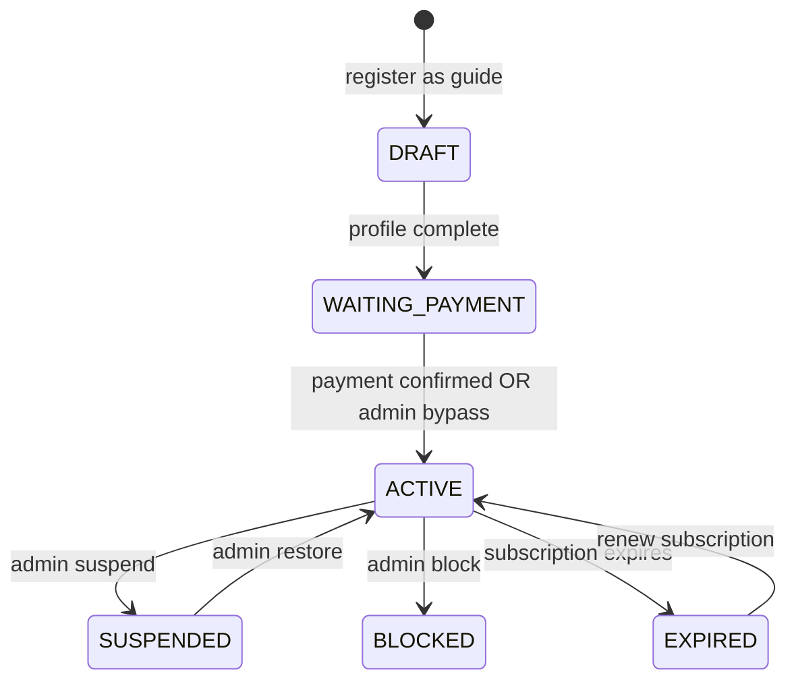
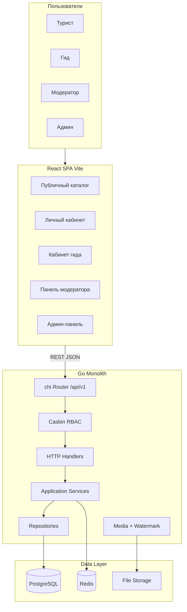
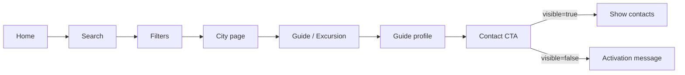

# Experts Tourister — спецификация MVP

> Документ для сверки понимания проекта перед реализацией.  
> Статус: **greenfield** (репозиторий пустой).  
> Дата: 2026-08-08.

---

## 1. Что это за продукт

**Experts Tourister** — двухслойное web-приложение (React SPA + Go API) — **каталог гидов и экскурсий**.

Референс по UX-паттернам: [Tripster Experience](https://experience.tripster.ru/) — карточки, фильтры, карта, профили, отзывы.  
**Не копируем** бренд, тексты, CSS, assets Tripster — нужен **собственный визуальный стиль**.

### Главная ценность платформы

```
Гид регистрируется
  → создаёт профиль и выбирает тип (GUIDE / ENTERTAINER / COMPANION)
  → (опционально) загружает лицензию — **только для отображения типа в каталоге**
  → выбирает города размещения
  → оплачивает подписку на размещение (или admin bypass)
  → становится ACTIVE
  → публикует экскурсии (после модерации)
  → турист находит гида/экскурсию
  → видит контакты (только у ACTIVE гида с активной подпиской)
  → связывается с гидом **вне платформы**
  → оставляет отзыв
```

### Центральный monetization mechanism

**Contact paywall** — турист видит телефон/Telegram/WhatsApp/email гида **только если**:

- `guide.status == ACTIVE`
- `subscription.status == ACTIVE`
- `subscription.expires_at > NOW()`
- гид не `BLOCKED` и не `SUSPENDED`

Backend **физически не отдаёт** контактные поля в JSON, если условия не выполнены. Это не UI-условие, а security boundary.

---

## 2. Что есть в MVP и чего нет

### Есть в MVP

| Область | Функционал |
|---------|------------|
| Auth | Регистрация, login, JWT access + refresh rotation, Argon2id |
| Роли | TOURIST, GUIDE, MODERATOR, ADMIN + Casbin RBAC |
| Гео | countries → regions → cities, карта, поиск по гео |
| Гиды | Профили, типы, города, опциональный upload лицензии (display в каталоге), ротация |
| Экскурсии | CRUD, категории, модерация, публичный каталог, фильтры |
| Монетизация | **Один поток:** `GUIDE_PLACEMENT` (подписка на размещение) |
| Отзывы | Рейтинг 1–5, комментарии гида, пересчёт rating |
| Избранное | Гиды и экскурсии |
| Уведомления | PostgreSQL + longpoll через Redis signals |
| Медиа | Upload, watermark, private original / public watermarked |
| Календарь | CRUD слотов доступности гида (**информационный**, без бронирований) |
| Админка | Users, payments, plans, settings, analytics, audit log |
| Модерация | Экскурсии, отзывы, гео (документы — без блокирующей модерации) |
| SEO | Meta tags, OG, sitemap, robots, JSON-LD, slug URLs |

### Явно НЕТ в MVP

| Исключено | Причина |
|-----------|---------|
| Бронирование экскурсий | Турист не бронирует |
| Заказы / офферы | OrderService, OfferService не нужны |
| Оплата экскурсий туристом | Нет checkout для туриста |
| Комиссии с туриста, payout гиду | Нет payment flows кроме guide_placement |
| Полноценный чат / messenger | Только review_comments |
| WebSocket realtime | Longpoll достаточно |
| Elasticsearch | PostgreSQL full-text / ILIKE |
| Микросервисы | Один Go monolith |
| Event sourcing | Over-engineering для MVP |
| Fake payment при admin bypass | Только `activation_source = ADMIN_BYPASS` + audit |

---

## 3. Участники и роли

| Роль | Код | Что делает |
|------|-----|------------|
| Турист | `ROLE_TOURIST` | Ищет гидов/экскурсии, избранное, отзывы, видит контакты активных гидов |
| Гид | `ROLE_GUIDE` | Профиль, документы, города, экскурсии, календарь слотов, биллинг |
| Модератор | `ROLE_MODERATOR` | Экскурсии, отзывы, гео; просмотр документов (информационно) |
| Админ | `ROLE_ADMIN` | Всё модераторское + users, payments, plans, settings, analytics, audit |

**Admin наследует moderator** через Casbin: `g, ROLE_ADMIN, ROLE_MODERATOR`.

**Ownership checks** — дополнительно к Casbin: Guide A не может редактировать excursion Guide B (проверка в service layer).

---

## 4. Типы гидов и документы

> **Upload лицензии — только для отображения типа в публичном каталоге.**  
> Не блокирует сохранение профиля, оплату, ACTIVE и публикацию экскурсий.

### Enum `guide_type`

| Тип | Код | Лицензия | Отображение в каталоге |
|-----|-----|----------|------------------------|
| Гид | `GUIDE` | `GUIDE_LICENSE` (опционально) | Бейдж/метка «Гид» — **только если** загружена лицензия |
| Конферансье | `ENTERTAINER` | `ENTERTAINER_LICENSE` (опционально) | Бейдж «Конферансье» — **только если** загружена лицензия |
| Компаньон | `COMPANION` | — | Бейдж «Компаньон» — **всегда** (лицензия не нужна) |

### Логика отображения типа в каталоге

Поле `guide_type` в профиле гид выбирает **сам** при регистрации/редактировании.

**Публичное отображение типа** (карточка в каталоге, профиль для туриста):

| guide_type | license uploaded | Что видит турист |
|------------|------------------|------------------|
| `GUIDE` | да | Тип «Гид» + watermark-документ (если нужен в UI) |
| `GUIDE` | нет | Гид в каталоге **без** бейджа типа «Гид» |
| `ENTERTAINER` | да | Тип «Конферансье» |
| `ENTERTAINER` | нет | **Без** бейджа «Конферансье» |
| `COMPANION` | — | Тип «Компаньон» всегда |

- Проверка содержимого лицензии **не выполняется** — только факт upload.
- Upload **не обязателен** для перехода `DRAFT → WAITING_PAYMENT → ACTIVE`.
- Фильтр каталога по `guide_type` использует **сохранённое** значение `guide_type` (что выбрал гид), независимо от upload.

### Поля документа

```
id, guide_id, type, storage_key, mime_type, size, checksum,
created_at, updated_at
```

Статусы модерации документов **не используются** — upload/delete в любой момент.

---

## 5. Жизненный цикл гида

### Статусы guide profile

```
DRAFT
WAITING_PAYMENT
ACTIVE
SUSPENDED
BLOCKED
EXPIRED
```

(`PENDING_MODERATION` **не используется** для профиля гида — документы не блокируют активацию.)

(При истечении подписки — guide переходит в состояние, связанное с expired subscription; subscription `EXPIRED`.)

### Диаграмма переходов



`PENDING_MODERATION` для профиля гида **не используется** как обязательный этап перед оплатой.

### Инварианты

1. Upload лицензии **не блокирует** профиль, оплату и ACTIVE — влияет **только** на отображение бейджа типа в каталоге (GUIDE/ENTERTAINER).
2. Гид **не может стать ACTIVE** без активной подписки (или admin bypass при выключенных платежах).
3. `guide_cities` — только связь гида с географией. **Нет поля `is_paid`** — платность через `guide_subscriptions`.
4. Контакты скрыты для всех статусов кроме ACTIVE + active subscription.

---

## 6. Подписка и платежи

### Subscription plans

```
id, code, name, description, price, currency, duration_days,
is_active, sort_order, created_at, updated_at
```

### Guide subscription

```
id, guide_id, plan_id, status, starts_at, expires_at, paid_at,
payment_id, activation_source, created_at, updated_at
```

**Статусы подписки:** `PENDING | ACTIVE | EXPIRED | CANCELLED`

**Activation source:** `PAYMENT | ADMIN_BYPASS`

### Payment (MVP — один purpose)

**Purpose:** `GUIDE_PLACEMENT` только.

**Статусы:** `CREATED | PENDING | PAID | FAILED | CANCELLED | REFUNDED`

```
id, payer_id, payer_type, purpose, amount, currency, status,
provider_payment_id (UNIQUE), metadata, created_at, updated_at
```

### Stub payment flow (решение для MVP)

1. Гид выбирает план → `POST /api/v1/account/guide/billing/checkout`
2. Создаётся `payment` со статусом `PENDING`
3. В dev/stub: `POST /api/v1/payments/:id/confirm` (только при `PAYMENT_STUB_ENABLED=true` или ROLE_ADMIN)
4. Идемпотентная активация → use-case `ActivateGuideSubscription`

**Webhook skeleton** заложен для будущего провайдера; повторный webhook/confirm не создаёт дубликаты.

### Admin bypass

Настройка `site_settings.guide_placement_payments_enabled`:

| Значение | Поведение |
|----------|-----------|
| `true` | Гид обязан оплатить размещение |
| `false` | Админ активирует без payment, `activation_source = ADMIN_BYPASS` |

**Не создавать fake payment.** Все bypass операции → `audit_logs`.

### Use-case ActivateGuideSubscription

В **одной PostgreSQL transaction**:

1. Проверить payment PAID или ADMIN_BYPASS
2. Upsert subscription: `status=ACTIVE`, `expires_at = NOW() + duration_days`
3. `guide.status = ACTIVE`
4. Записать audit (для bypass обязательно)
5. Создать notification `SUBSCRIPTION_ACTIVATED`

**После COMMIT:**

- Invalidate Redis cache
- Redis signal для longpoll

Notification **не отправляется до COMMIT**.

---

## 7. Contact paywall (детально)

### Условие видимости контактов

```go
contactsVisible =
  guide.status == ACTIVE
  AND subscription.status == ACTIVE
  AND subscription.expires_at > NOW()
  AND guide.status NOT IN (BLOCKED, SUSPENDED)
```

### API response — неактивный гид

```json
{
  "id": "...",
  "display_name": "Иван",
  "about": "...",
  "rating_avg": 4.8,
  "contacts": {
    "visible": false
  }
}
```

### API response — активный гид

```json
{
  "contacts": {
    "visible": true,
    "phone": "+7...",
    "telegram": "@...",
    "whatsapp": "+7...",
    "email": "guide@example.com",
    "preferred_contact_method": "telegram"
  }
}
```

### Security rules

- **Не отдавать** скрытые контакты в других полях JSON
- **Не включать** контакты в public list endpoints (каталог гидов)
- **Не кэшировать** контакты в Redis — только базовый профиль без PII
- Contact DTO формируется отдельным методом `BuildPublicGuideDTO`

---

## 8. Экскурсии

### Поля

```
id, guide_id, city_id, category_id, title, slug, description,
type, max_guests, price_from, currency, status,
created_at, updated_at
```

### Типы экскурсии и `max_guests`

| Тип | Описание |
|-----|----------|
| `INDIVIDUAL` | Индивидуальная экскурсия |
| `GROUP` | Групповая экскурсия |

**`max_guests` — произвольное поле, задаётся гидом.** Жёстких лимитов 6 / 20 **нет**.

Валидация backend:
- `max_guests` — целое число `>= 1`
- разумный верхний предел на уровне API (например `<= 100`) для защиты от мусора — **не бизнес-правило 6/20**

Рекомендации 6 / 20 можно показать в UI как подсказку, но **не enforce**.

### Статусы

```
DRAFT → PENDING_MODERATION → PUBLISHED
                            → REJECTED
PUBLISHED → ARCHIVED
PUBLISHED → PENDING_MODERATION (при изменении чувствительных полей)
```

### Публичная видимость

Экскурсия видна только если:

```
excursion.status == PUBLISHED
AND guide.status == ACTIVE
```

### Re-moderation policy (default)

Изменение у `PUBLISHED` экскурсии полей `title`, `description`, `price_from`, `photos`, `type`, `max_guests`, `city_id` → перевод в `PENDING_MODERATION`.

---

## 9. Отзывы и рейтинг

### Review

```
id, guide_id, author_id, rating (1..5), text, status,
created_at, updated_at
```

**Статусы:** `PENDING | PUBLISHED | REJECTED | HIDDEN`

**Constraint:** один отзыв на туриста на гида — `UNIQUE(author_id, guide_id)`.

`order_id` **не используется** — заказов нет.

### Review comments

Гид может ответить на отзыв. Таблица `review_comments`.  
**Не** полноценный MessageService / чат.

### Rating recalculation

При publish/hide/reject review — пересчёт `rating_avg`, `rating_count` в **transaction**.

---

## 10. Гео, поиск, ротация

### Иерархия

```
countries → regions → cities
```

### City fields

```
id, country_id, region_id, slug, name, latitude, longitude,
timezone, is_active
```

### Поиск (PostgreSQL, без Elasticsearch)

Фильтры:

- city, country, region
- guide_type
- language, specialization
- rating
- text search (ILIKE / tsvector)
- pagination обязательна

### Guide rotation в городе

Fair rotation:

```
ACTIVE guides
→ city match
→ apply filters
→ ORDER BY last_shown_at ASC, rating_avg DESC
```

Архитектура допускает позже: featured, boost, paid ranking.

---

## 11. Календарь (информационный)

### Scope MVP

- Таблица `guide_availability_slots`
- CRUD слотов — гид отмечает когда свободен
- Frontend: `/account/guide/calendar`

### Чего НЕТ

- Бронирования туристом
- Orders / offers
- Уведомления туристу о слотах
- Блокировка слотов при «заказе»

---

## 12. Уведомления и longpoll

### Notifications (PostgreSQL — source of truth)

```
id, user_id, type, payload (jsonb), read_at, created_at
```

**Типы:**

- `EXCURSION_APPROVED`, `EXCURSION_REJECTED`
- `SUBSCRIPTION_ACTIVATED`, `SUBSCRIPTION_EXPIRED`
- `NEW_REVIEW`, `REVIEW_COMMENT`

### Longpoll

```
GET /api/v1/notifications/longpoll?after={cursor}&timeout=25
```

Алгоритм:

1. Query notifications after cursor
2. If exists → return immediately
3. Else wait on Redis signal (max 25s)
4. Re-query PostgreSQL
5. Return batch + new cursor
6. Client reconnects

Требования: auth, cursor validation, graceful shutdown, timeout.

Redis — **только signal/fanout**, не source of truth.

---

## 13. Медиа и watermark

### Media entity

```
id, owner_type, owner_id, type, storage_key, mime_type, size,
checksum, width, height, status, created_at, updated_at
```

**Типы:** `GUIDE_AVATAR | GUIDE_PHOTO | GUIDE_DOCUMENT | EXCURSION_PHOTO`

### Pipeline

```
Upload → validate MIME/size
       → store original (PRIVATE)
       → generate watermarked version (PUBLIC)
       → save media row
```

- Публичные endpoints отдают **только watermarked**
- Original files **never public**
- Storage abstraction: local FS сейчас, S3-compatible позже
- `WatermarkProcessor` interface — sync сейчас, background worker позже

---

## 14. Audit log

```
id, actor_id, action, entity_type, entity_id,
old_value, new_value, ip, user_agent, created_at
```

**Аудируем:**

- login, logout
- moderation decisions (excursions, reviews)
- guide block/unblock
- payment bypass
- plan change, site setting change
- user role change, user block
- excursion moderation

---

## 15. Архитектура системы

### Общая схема



### Backend layers (строго)

```
HTTP Handler
    ↓  (DTO mapping, no business logic)
Application Service
    ↓  (business rules, ownership, paywall)
Repository
    ↓
PostgreSQL
```

**Запрещено:**

- SQL в handlers
- Redis из handlers напрямую
- Business logic в handlers
- Global mutable state

### Tech stack

| Компонент | Технология |
|-----------|------------|
| Backend | Go, chi |
| Database | PostgreSQL 16 |
| Cache/Sessions/Longpoll | Redis 7 |
| RBAC | Casbin |
| Auth | JWT access + refresh rotation |
| Passwords | Argon2id |
| Logging | slog + request_id |
| API | REST `/api/v1` |
| Docs | OpenAPI |
| Frontend | React + TypeScript + Vite |
| Styling | **Tailwind CSS** — utility-first, минимум custom CSS |
| Routing | React Router |
| Server state | TanStack Query |
| Forms | React Hook Form + Zod |
| Local infra | Docker Compose / OrbStack |

---

## 16. Структура репозитория

```
/
├── backend/
│   ├── cmd/api/main.go
│   ├── internal/
│   │   ├── config/
│   │   ├── domain/           # entities, enums, domain errors
│   │   ├── repo/postgres/    # SQL repositories
│   │   ├── cache/redis/
│   │   ├── service/          # business services
│   │   ├── http/             # handlers, middleware, dto
│   │   ├── rbac/             # Casbin + policy.csv
│   │   ├── media/            # storage interface, watermark
│   │   ├── auth/             # JWT, Argon2id
│   │   ├── audit/
│   │   └── seed/
│   ├── migrations/
│   │   ├── 000001_users.sql
│   │   ├── 000002_geo.sql
│   │   ├── ...
│   │   └── 000015_demo_seed.sql
│   └── openapi/openapi.yaml
├── frontend/
│   └── src/
│       ├── app/              # router, providers
│       ├── api/              # client.ts, endpoints
│       ├── components/       # shared UI
│       ├── features/         # domain features
│       ├── pages/
│       ├── layouts/
│       ├── hooks/
│       ├── lib/
│       ├── types/
│       └── utils/
├── docker-compose.yml        # postgres:16 + redis:7
├── .env.example
└── README.md
```

---

## 17. API structure

**Prefix:** `/api/v1`

| Group | Назначение |
|-------|------------|
| `/auth` | register, login, refresh, logout |
| `/geo` | countries, regions, cities, map |
| `/guides` | public guide catalog, profile by slug |
| `/excursions` | public excursion catalog, by slug |
| `/reviews` | public reviews list |
| `/favorites` | user favorites |
| `/account` | tourist LK (settings, favorites, reviews) |
| `/account/guide` | guide profile, excursions, docs, billing, calendar |
| `/moderator` | moderation queues |
| `/admin` | users, payments, plans, settings, analytics, audit |
| `/notifications` | list + longpoll |
| `/media` | upload, serve watermarked |

### Error format (единый)

```json
{
  "error": {
    "code": "GUIDE_SUBSCRIPTION_REQUIRED",
    "message": "Guide subscription is required",
    "request_id": "uuid"
  }
}
```

Stack trace клиенту **не отдаётся**.

### Health

- `GET /healthz` — process alive
- `GET /readyz` — PostgreSQL + Redis available

---

## 18. Frontend — архитектура сайта

### Public routes

| Route | Страница |
|-------|----------|
| `/` | Главная |
| `/search` | Поиск |
| `/map` | Карта |
| `/country/:slug` | Страна |
| `/region/:slug` | Регион |
| `/city/:slug` | Город (гиды + экскурсии) |
| `/guides` | Каталог гидов |
| `/guide/:slug` | Профиль гида + contact CTA |
| `/excursions` | Каталог экскурсий |
| `/excursion/:slug` | Страница экскурсии |

### Account routes (турист)

| Route | Страница |
|-------|----------|
| `/account` | Обзор ЛК |
| `/account/settings` | Настройки |
| `/account/favorites` | Избранное |
| `/account/reviews` | Мои отзывы |

### Guide routes

| Route | Страница |
|-------|----------|
| `/account/guide` | Dashboard гида |
| `/account/guide/profile` | Редактирование профиля |
| `/account/guide/excursions` | Список экскурсий |
| `/account/guide/excursions/new` | Создание экскурсии |
| `/account/guide/calendar` | Слоты доступности |
| `/account/guide/documents` | Загрузка документов |
| `/account/guide/billing` | Оплата размещения |
| `/account/guide/subscription` | Статус подписки |

### Moderator routes

| Route | Страница |
|-------|----------|
| `/moderator` | Dashboard |
| `/moderator/documents` | Просмотр загруженных документов (информационно) |
| `/moderator/excursions` | Модерация экскурсий |
| `/moderator/reviews` | Модерация отзывов |
| `/moderator/geo` | Управление гео |

### Admin routes

| Route | Страница |
|-------|----------|
| `/admin` | Dashboard |
| `/admin/users` | Пользователи |
| `/admin/guides` | Гиды |
| `/admin/payments` | Платежи |
| `/admin/subscriptions` | Подписки |
| `/admin/plans` | Тарифные планы |
| `/admin/analytics` | Аналитика |
| `/admin/settings` | Настройки (тумблеры) |
| `/admin/audit` | Audit log |

### Public user flow (UX)



### Frontend architecture rules

- **Не складывать всё в App.tsx** — feature folders
- TanStack Query для server state
- Zod для validation schemas
- RHF для сложных форм
- API client: `frontend/src/api/client.ts`
- Types: `frontend/src/types/`

### UX / Design

**Можно (паттерны):** крупные фото, карточки, фильтры, карта, sticky CTA, mobile-first.

**Нельзя:** копировать Tripster brand/assets/CSS.

**Не делать:** generic SaaS dashboard purple/Inter style.

### Tailwind CSS (обязательно)

- **Tailwind CSS** — основной инструмент вёрстки.
- Стили **максимально в utility-классах** (`className`), не в отдельных CSS-файлах.
- `@apply` — только для повторяющихся паттернов в `@layer components` (кнопки, карточки, input).
- Глобальный CSS минимален: `@tailwind base/components/utilities`, CSS variables (цвета, шрифты), `@layer base` для typography reset.
- Структура: `frontend/src/styles/globals.css` + `tailwind.config.ts` с design tokens (colors, spacing, fonts).
- **Не создавать** большие `.module.css` / `.scss` файлы на компонент — prefer Tailwind utilities + `cn()` helper (`clsx` + `tailwind-merge`).

### SEO

- `react-helmet-async`: title, description, canonical, OG
- `/sitemap.xml`, `/robots.txt`
- JSON-LD structured data (Guide, Excursion)
- Slug-based URLs
- Архитектура готова к SSR/prerender позже

---

## 19. Безопасность

| Мера | Реализация |
|------|------------|
| Passwords | Argon2id |
| Access token | Short-lived JWT |
| Refresh token | Rotation, Redis, httpOnly Secure SameSite cookie |
| RBAC | Casbin URL+method + service ownership |
| Rate limiting | `/auth/*` |
| Upload limits | Body size, file size, MIME validation |
| Storage keys | Random, не guessable |
| PII in logs | Запрещено |
| CORS | Whitelist |
| Contact leak | API-level paywall, no cache of contacts |

---

## 20. Redis usage

| DB index | Назначение |
|----------|------------|
| 0 | Cache (TTL обязателен) — geo, guides list **без контактов** |
| 1 | Refresh sessions |
| 2 | Longpoll signals |

**Правила:**

- PostgreSQL = source of truth
- Cache invalidation после write
- Redis **не хранит** бизнес-истину

---

## 21. Миграции БД

| # | Migration | Содержание |
|---|-----------|------------|
| 000001 | users | users, roles, refresh_tokens |
| 000002 | geo | countries, regions, cities |
| 000003 | guides | guide_profiles, guide_cities, languages, specializations |
| 000004 | guide_documents | documents (upload for categorization, no status moderation) |
| 000005 | media | media table |
| 000006 | subscriptions | plans, guide_subscriptions |
| 000007 | payments | payments |
| 000008 | excursions | excursions, categories |
| 000009 | reviews | reviews, review_comments |
| 000010 | favorites | favorites |
| 000011 | notifications | notifications |
| 000012 | settings | site_settings |
| 000013 | audit | audit_logs |
| 000014 | availability | guide_availability_slots |
| 000015 | demo_seed | idempotent demo data |

---

## 22. Demo accounts (dev seed)

| User | Password | Role |
|------|----------|------|
| guide1 | guide12345 | GUIDE |
| moderator | moderator123 | MODERATOR |
| admin | admin12345 | ADMIN |
| tourist1 | tourist12345 | TOURIST |

Seed **idempotent** — повторный запуск не создаёт duplicates.

Дополнительно: sample geo (1 country, 2–3 cities), 1 subscription plan.

---

## 23. План реализации по фазам

| Phase | Содержание | Результат |
|-------|------------|-----------|
| **0** | Bootstrap | docker-compose, config, migrations, health, slog |
| **1** | Auth + RBAC | users, JWT, Casbin, demo accounts |
| **2** | Geo | countries/regions/cities CRUD + public API |
| **3** | Guides + Media | profiles, types, docs (categorization), watermark |
| **4** | Billing + Paywall | plans, stub payment, activate, contact paywall |
| **5** | Excursions | CRUD, moderation, catalog, filters, rotation |
| **6** | Reviews | reviews, comments, rating, favorites |
| **7** | Notifications | PG notifications, Redis signals, longpoll |
| **8** | Calendar | availability slots CRUD |
| **9** | Admin/Audit | admin panels, analytics, settings, audit |
| **10** | Frontend polish | full SPA, SEO, responsive, E2E |

**Правило:** каждая фаза — tests + compile + migrations check перед переходом к следующей.

---

## 24. Тестирование

### Unit tests

- Contact visibility logic
- ActivateGuideSubscription
- Subscription expiration
- Document upload presence → catalog type badge display (not blocking flow)
- Rating calculation
- Excursion max_guests validation (positive integer, no hard 6/20)
- RBAC ownership

### Integration tests

- Auth flow
- Migrations up/down
- Document upload → catalog type badge visibility (optional, non-blocking)
- Payment confirm idempotency
- Review uniqueness
- Longpoll basic

### E2E happy path

```
tourist1 registers
→ guide1 registers (type GUIDE, без лицензии)
→ guide selects plan → stub confirm → ACTIVE
→ guide optionally uploads license → бейдж «Гид» в каталоге
→ guide creates excursion
→ stub payment confirm
→ subscription activates, guide ACTIVE
→ guide creates excursion
→ moderator/admin publishes excursion
→ tourist searches city
→ tourist opens guide profile
→ tourist sees contacts (paywall passed)
→ tourist leaves review
→ rating recalculated
```

---

## 25. Definition of Done (MVP готов)

- [ ] `docker compose up` поднимает Postgres + Redis (OrbStack)
- [ ] Migrations применяются с нуля
- [ ] Seed idempotent
- [ ] `go test ./...` и `go vet ./...` проходят
- [ ] `npm run build` проходит
- [ ] Authentication + Casbin работают
- [ ] Guide registration + document upload + watermark
- [ ] Document upload for guide categorization (no blocking moderation)
- [ ] Stub payment + idempotent confirm
- [ ] Admin bypass + audit (без fake payment)
- [ ] Contact paywall на API level (unit tests)
- [ ] Excursion moderation + public catalog
- [ ] Reviews + rating + favorites
- [ ] Notifications + longpoll
- [ ] Audit log
- [ ] Calendar slots CRUD (без bookings)
- [ ] Responsive frontend (Tailwind), SEO metadata
- [ ] E2E happy path проходит
- [ ] OpenAPI актуален

---

## 26. 20 критических инвариантов (не нарушать)

1. Турист **не бронирует** экскурсии в MVP
2. Турист **не платит** за экскурсии
3. Upload лицензии — **только display** бейджа типа в каталоге, не блокирует flow
4. GUIDE — бейдж «Гид» в каталоге **только при** upload GUIDE_LICENSE
5. ENTERTAINER — бейдж «Конферансье» **только при** upload ENTERTAINER_LICENSE
6. COMPANION — бейдж всегда, лицензия не нужна
7. `max_guests` экскурсии задаёт гид — **нет** жёстких лимитов 6/20
8. Original files — private
9. Public media — watermarked
10. Публично eligible только ACTIVE guide
11. Контакты только при ACTIVE subscription
12. BLOCKED/SUSPENDED — контакты скрыты
13. Публично только PUBLISHED excursions
14. PUBLISHED excursion → ACTIVE guide
15. Payment webhook/confirm — idempotent
16. Subscription activation — transactional
17. Admin bypass — audited, no fake payment
18. Redis — не source of truth
19. Guide ownership — service layer check
20. Rating — transactional recalc; один review per tourist per guide

---

## 27. Принятые решения (уточнения)

| Вопрос | Решение |
|--------|---------|
| Payment provider | **Stub** — checkout + dev confirm endpoint |
| Calendar scope | **CRUD slots** — без bookings/orders |
| guide_cities.is_paid | **Убрано** — платность через subscriptions |
| is_active только | **Заменено** на guide.status enum |
| OrderService | **Убран полностью** |
| Chat | **Только review_comments** |
| Документы | **Upload опционален** — только display типа в каталоге |
| max_guests | **Задаёт гид**, без лимитов 6/20 |
| Frontend CSS | **Tailwind CSS**, utilities-first, минимум custom CSS |

---

## 28. Defaults (можно оспорить позже)

- OpenAPI: swaggo или ручной yaml
- Guide slug: auto from display_name + suffix on collision
- Subscription expiration: background job on startup
- Text search: PostgreSQL ILIKE + optional tsvector
- Frontend fonts: distinctive pairing через Tailwind `fontFamily`, не Inter/Roboto default

---

## 29. Чеклист для сверки понимания

Ответьте «да/нет/изменить» по пунктам:

- [ ] Продукт — каталог гидов, **не** booking platform
- [ ] Единственный payment flow — `GUIDE_PLACEMENT` (stub)
- [ ] Contact paywall — главный monetization mechanism
- [ ] Backend не отдаёт контакты неактивным гидам
- [ ] 3 типа гидов: GUIDE, ENTERTAINER, COMPANION
- [ ] Upload лицензии опционален — влияет только на бейдж типа в каталоге
- [ ] max_guests задаёт гид, без лимитов 6/20
- [ ] Вёрстка на Tailwind CSS (utilities-first)
- [ ] Watermark на все uploads, original private
- [ ] Экскурсии модерируются, публично только PUBLISHED + ACTIVE guide
- [ ] Календарь — слоты без бронирований
- [ ] Longpoll notifications, не WebSocket
- [ ] Casbin + service ownership checks
- [ ] Audit log для bypass и модерации
- [ ] UX как Tripster patterns, свой visual style
- [ ] Фазы 0→10 с тестами на каждой фазе

---

*Документ создан для согласования перед началом Phase 0.*
